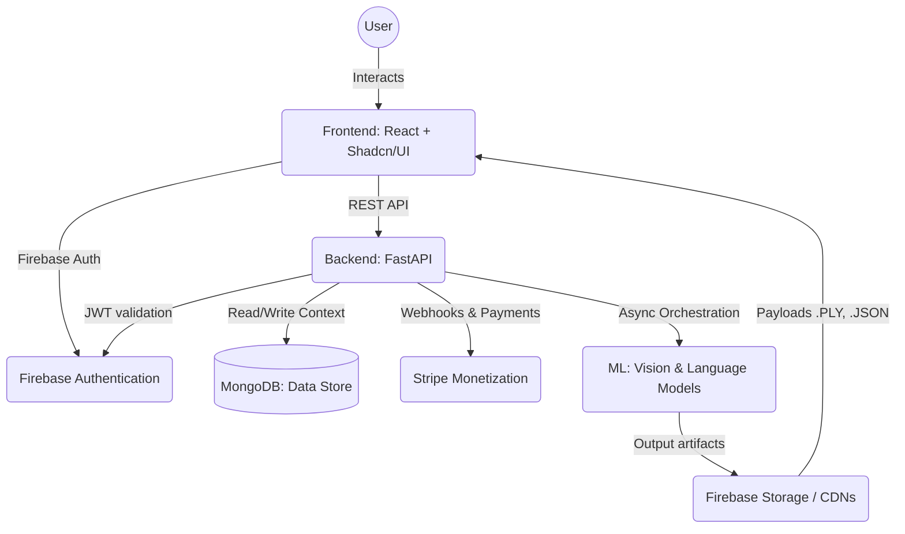

# VoxAssist 🎙️🏡

VoxAssist is an AI-powered architectural layout generator that converts structural dimensions and conversational prompts into full-scale 2D floorplans and 3D architectural models. Built for modern performance using a FastAPI Python backend orchestration plane and a React/Firebase visual interface.

## System Architecture

## Features
- **Prompt to Floorplan**: Type in spatial requirements, get structured room definitions and visual mappings.
- **3D Visualization**: Immediate structural parsing of 2D plans into robust 3D meshes rendered via React Three Fiber.
- **Real-time UX**: Clean interfaces built with Radix and Shadcn Primitives featuring fluid Dark Mode switching.
- **Freemium Metering**: Users receive 5 free layout generations. Upgrade via Stripe to unlock unlimited orchestration. 

## API Documentation 📚

Once the backend is live, interactive API documentation is automatically generated by Swagger UI:
- **Local Swagger UI**: `http://localhost:8000/docs`
- **ReDoc Alternate UI**: `http://localhost:8000/redoc`

Explore standard CRUD design endpoints, Monetization API Webhooks, and User metric trackers inherently.

## Getting Started

### Backend Pipeline (FastAPI)
1. Navigate to `/backend`
2. Configure `.env` using `.env.example` as reference.
3. Boot the API: `uvicorn main:app --reload`
4. The API orchestrates on port 8000.

### Frontend App (React.js)
1. Navigate to `/frontend`
2. Install packages: `npm install`
3. Load the dev server: `npm run dev`
4. The dashboard orchestrates on port 5173.

## Continuous Integration & DevOps
- Built entirely within a Docker orchestrator (`docker-compose up -d`) to manage MongoDB, API layers, and frontends instantly.
- Handled with GitHub Actions testing components automatically enforcing Pytest, Vitest, and pip-audit static scans.

## Contributing
All engineers must view the standard [CONTRIBUTING.md](./CONTRIBUTING.md) structure before submitting PR logic.
See the [CHANGELOG.md](./CHANGELOG.md) to understand the progression path of V2 architecture integrations.
